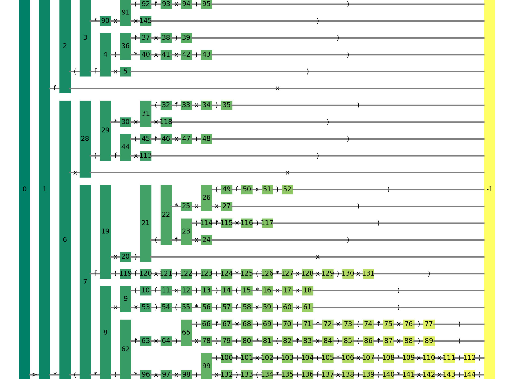

# SFG - Separated grammar research package

This package is centered around separated grammars and their inference/induction/restoration

Grammar inference is a process of producing a formal grammar from a set of given sentences.\
Implemented inference algorithm is based on prefix-parallel-series network analysis and transformation.

Context-Free grammar is **separated** if all of its productions start with a terminal.\
And for all nonterminals, no two productions start with the same terminal.

Example of a separated grammar:

```
S -> > F
F -> * V V | f V
V -> x | ( F ) 
```

## Overview

Consider a following list of sentences, generated by a grammar given above:

```python
sents = ['>fx', '>f(fx)', '>f(f(fx))', '>f(f(*xx))', '>f(*x(fx))', '>f(*xx)',
    '>*(*x(fx))(*xx)', '>*(*xx)(*(fx)x)', '>*(*(fx)(fx))(*x(fx))', 
    '>*(*(fx)x)(*(fx)(fx))', '>*(*(*xx)(fx))(*x(*xx))', '>*(*(*xx)x)(*(fx)(*xx))', 
    '>*(fx)(fx)', '>*(fx)(f(fx))', '>*(fx)(*xx)', '>*(fx)(*x(fx))', '>*(fx)x', 
    '>*(f(fx))(*(*xx)x)', '>*xx', '>*x(*x(fx))', '>*x(*xx)', '>*x(f(fx))', '>*x(fx)']
```

We can try to infer a grammar back (note that it is a lengthy process):

```python
from SFG.restore import restore

g = restore(sents) # g is a nltk.CFG
g.productions() # [1 -> '>' 0 2, 0 -> 'f', 0 -> '*' 2, 2 -> 'x', 2 -> '(' 0 2 ')']
```

You can see that infered grammar has a bit different structure from the original, however, they do generate the same language.
This is due to `restore` algorithm producing a separated grammar in a canonical form.
For every separated language there is only one separated grammar in canonical form, that can produce it.

Inference/restoration algorithm is based on manipulation of prefix-parallel-series network, constructed from the input sentences.
In fact, this package provides a class (based on `networkx.MultiDiGraph`) for such networks

```python
from SFG.pnet import Pnet

p = Pnet(sents)
p.draw() # parallel-series net drawing, using matplotlib primitives
```



